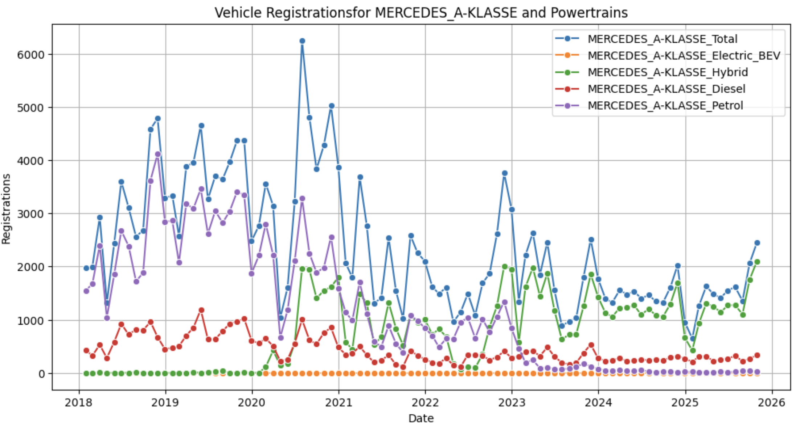
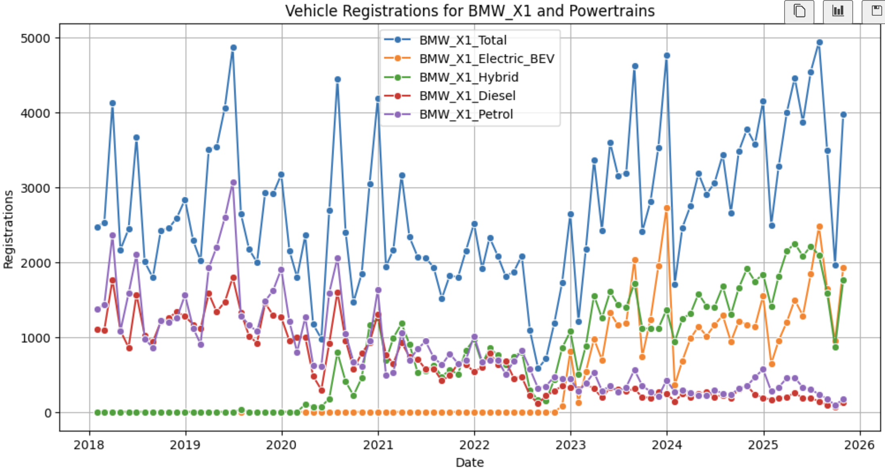

# Automotive Industry Trends Forecasting using Neural Networks

> **Master's Thesis Project** | Supervised and Unsupervised Learning Course | HdM Stuttgart  
> Authors: John Torres, Samuel Hempelt

[](https://www.python.org/downloads/)
[](https://opensource.org/licenses/MIT)

---

## Abstract

This project investigates time series forecasting of vehicle registration trends in the German automotive market using neural network architectures. Leveraging monthly registration data from the Kraftfahrt-Bundesamt (KBA) spanning 2018–2025, we analyze registration patterns across multiple Original Equipment Manufacturers (OEMs), vehicle models, and powertrain types (Electric, Hybrid, Diesel, Petrol). The primary objective is to develop robust forecasting models capable of predicting future registration volumes at the most granular level—individual model-powertrain combinations—thereby providing insights into the evolving landscape of automotive mobility.

---

## Table of Contents

- [Introduction](#introduction)
- [Dataset](#dataset)
- [Methodology](#methodology)
- [Installation](#installation)
- [Usage](#usage)
  - [Data Acquisition](#data-acquisition)
  - [Data Preprocessing](#data-preprocessing)
- [Exploratory Data Analysis](#exploratory-data-analysis)
- [Model Architecture](#model-architecture)
- [Results](#results)
- [Discussion](#discussion)
- [References](#references)
- [License](#license)

---

## Introduction

The automotive industry is undergoing a significant transformation driven by the transition toward electric mobility and sustainability initiatives. Understanding registration trends across different powertrain technologies is crucial for manufacturers, policymakers, and researchers. This project aims to:

- **Analyze** historical vehicle registration data at a granular level (OEM × Model × Powertrain)
- **Forecast** future registration volumes using state-of-the-art neural network models
- **Identify** patterns and trends in the adoption of alternative powertrains (BEV, Hybrid)
- **Provide** actionable insights for strategic planning and market analysis

---

## Dataset

### Data Source

Vehicle registration data is sourced from the **Kraftfahrt-Bundesamt (KBA)**, Germany's Federal Motor Transport Authority, specifically from the monthly [FZ10 statistical reports](https://www.kba.de/DE/Statistik/Produktkatalog/produkte/Fahrzeuge/fz10).

### Temporal Coverage

- **Period:** January 2018 – October 2025
- **Frequency:** Monthly observations

### Features

- **OEM (Original Equipment Manufacturer):** Vehicle manufacturer (e.g., BMW, Mercedes-Benz, Volkswagen)
- **Model:** Specific vehicle model (e.g., A-Class, X1, Golf)
- **Powertrain Types:**
  - Total registrations
  - Electric (BEV - Battery Electric Vehicles)
  - Hybrid (including Plug-in Hybrid)
  - Diesel
  - Petrol
- **Additional Features:** All-wheel drive, convertibles

### Data Characteristics

- **Granularity:** Model-level registrations per powertrain type
- **Format:** Parquet (post-processing)
- **Filtering Criteria:** Analysis focuses on time series with at least 12 months of historical data to ensure model reliability
- **Dataset Statistics:**
  - Total time series: 3,745 individual OEM-model-powertrain combinations
  - Total data points: 231,938 observations
  - Average series length: ~62 months per time series

---

## Methodology

The project follows a structured workflow:

1. **Data Acquisition:** Automated download of monthly FZ10 Excel reports from KBA
2. **Data Preprocessing:** Cleaning, transformation, and normalization
3. **Exploratory Data Analysis:** Statistical analysis and visualization
4. **Feature Engineering:** Creation of time-based features and lag variables
5. **Model Development:** Implementation of neural network architectures
6. **Model Evaluation:** Performance assessment using industry-standard metrics
7. **Forecasting:** Generation of future predictions

### Forecasting Approaches

This study explores multiple forecasting methodologies:

- **Univariate Models:** Time series forecasting based solely on historical registration patterns of individual model-powertrain combinations
- **Multivariate Models:** Leveraging relationships between multiple time series (e.g., cross-model dependencies, powertrain correlations)
- **Exogenous Variables Integration:** Incorporating external economic indicators to enhance forecast accuracy:
  - Monthly GDP growth rates
  - Interest rates (ECB policy rates)
  - Consumer confidence indices
  - Fuel prices
  - Government incentives for electric vehicles
  - Other relevant socioeconomic indicators

The comparative evaluation of these approaches will provide insights into the relative importance of internal patterns versus external factors in automotive registration forecasting.

---

## Installation

### Prerequisites

- Python 3.12 or higher
- [uv](https://github.com/astral-sh/uv) package manager (recommended)

### Setup

1. **Clone the repository:**

```bash
git clone https://github.com/john2408/neural_networks_project_hdm.git
cd neural_networks_project_hdm
```

2. **Create and activate virtual environment:**

```bash
uv venv
source .venv/bin/activate  # On macOS/Linux
# .venv\Scripts\activate   # On Windows
```

3. **Install dependencies:**

```bash
uv sync
```

---

## Usage

### Data Acquisition

Download all monthly FZ10 reports from the KBA website:

```bash
python neuralts/data_preparation/fetch_kba.py
```

**Output:** Raw Excel files stored in `data/raw/kba/`

### Data Preprocessing

Execute the data cleaning pipeline to transform raw Excel files into a structured time series dataset:

```bash
python neuralts/data_preparation/data_cleaning.py
```

**Output:** Cleaned dataset in Parquet format stored in `data/processed/`

**Data Transformations:**
- Standardization of column names
- Handling of missing values
- Aggregation of hybrid powertrain subcategories
- Conversion from wide to long format
- Creation of unique time series identifiers

---

## Exploratory Data Analysis

Below are representative examples of registration trends at the model-powertrain level:

### Mercedes-Benz A-Class: Powertrain Distribution



*Figure 1: Monthly registration trends for Mercedes-Benz A-Class across different powertrain types (2018-2025)*

### BMW X1: Powertrain Evolution



*Figure 2: BMW X1 registration patterns showing the shift toward electric and hybrid powertrains*

**Key Observations:**
- Clear upward trend in electric vehicle (BEV) registrations
- Declining diesel registrations post-2019
- Seasonal patterns in overall registration volumes
- Model-specific adoption rates for alternative powertrains

---

## Model Architecture

*(To be completed with specific neural network architectures used)*

Planned architectures include:
- **LSTM (Long Short-Term Memory)** networks for capturing temporal dependencies
- **GRU (Gated Recurrent Unit)** as a lighter alternative
- **Temporal Convolutional Networks (TCN)** for parallel processing
- **Transformer-based models** for attention mechanisms
- **Hybrid architectures** combining multiple approaches

---

## Results

*(To be populated with model performance metrics)*

Evaluation metrics:
- Mean Absolute Error (MAE)
- Mean Absolute Percentage Error (MAPE)
- Root Mean Squared Error (RMSE)
- R² Score

---

## Discussion

*(To be completed with insights and analysis)*

This section will discuss:
- Model performance comparison
- Forecasting accuracy across different segments
- Limitations and challenges
- Practical implications for the automotive industry
- Future research directions

---

## References

1. Kraftfahrt-Bundesamt (KBA). (2018-2025). *Fahrzeugzulassungen - FZ10 Monatsergebnisse*. Retrieved from https://www.kba.de

---

## License

This project is licensed under the MIT License - see the [LICENSE](LICENSE) file for details.

---

## Acknowledgments

This project was developed as part of the Supervised and Unsupervised Learning course at **Hochschule der Medien Stuttgart (HdM)**. We thank our course instructor for the guidance.

---

**Project Repository:** [github.com/john2408/neural_networks_project_hdm](https://github.com/john2408/neural_networks_project_hdm)

