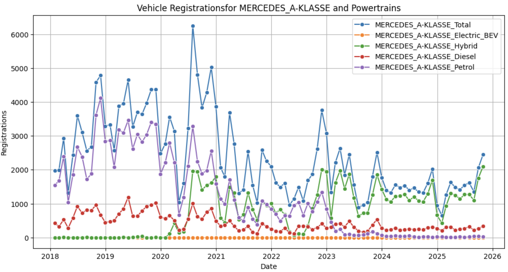
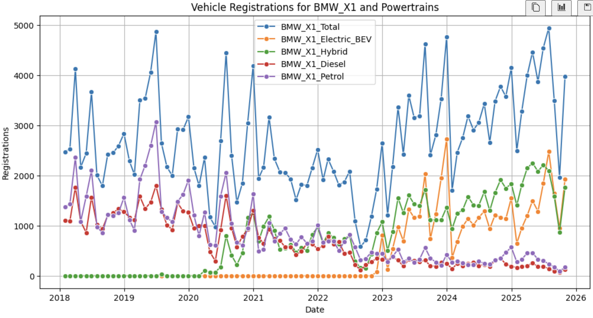

# Automotive Industry Trends Forecasting using Neural Networks

> Supervised and Unsupervised Learning Course | HdM Stuttgart  
> Authors: John Torres, Samuel Hempelt

[](https://www.python.org/downloads/)
[](https://opensource.org/licenses/MIT)

---

## Abstract

This project investigates time series forecasting of vehicle registration trends in the German automotive market using neural network architectures. Leveraging monthly registration data from the Kraftfahrt-Bundesamt (KBA) spanning 2018–2025, we analyze registration patterns across multiple Original Equipment Manufacturers (OEMs), vehicle models, and powertrain types (Electric, Hybrid, Diesel, Petrol). The primary objective is to develop robust forecasting models capable of predicting future registration volumes at the most granular level—individual model-powertrain combinations—thereby providing insights into the evolving landscape of automotive mobility.

---

## Table of Contents

- [Introduction](#introduction)
- [Dataset](#dataset)
- [Methodology](#methodology)
- [Installation](#installation)
- [Usage](#usage)
  - [Data Acquisition](#data-acquisition)
  - [Data Preprocessing](#data-preprocessing)
- [Exploratory Data Analysis](#exploratory-data-analysis)
- [Model Architecture](#model-architecture)
- [Results](#results)
- [Discussion](#discussion)
- [References](#references)
- [License](#license)

---

## Introduction

The automotive industry is undergoing a significant transformation driven by the transition toward electric mobility and sustainability initiatives. Understanding registration trends across different powertrain technologies is crucial for manufacturers, policymakers, and researchers. This project aims to:

- **Analyze** historical vehicle registration data at a granular level (OEM × Model × Powertrain)
- **Forecast** future registration volumes using state-of-the-art neural network models
- **Identify** patterns and trends in the adoption of alternative powertrains (BEV, Hybrid)
- **Provide** actionable insights for strategic planning and market analysis

---

## Dataset

### Data Source

Vehicle registration data is sourced from the **Kraftfahrt-Bundesamt (KBA)**, Germany's Federal Motor Transport Authority, specifically from the monthly [FZ10 statistical reports](https://www.kba.de/DE/Statistik/Produktkatalog/produkte/Fahrzeuge/fz10).

### Temporal Coverage

- **Period:** January 2018 – October 2025
- **Frequency:** Monthly observations

### Features

- **OEM (Original Equipment Manufacturer):** Vehicle manufacturer (e.g., BMW, Mercedes-Benz, Volkswagen)
- **Model:** Specific vehicle model (e.g., A-Class, X1, Golf)
- **Powertrain Types:**
  - Total registrations
  - Electric (BEV - Battery Electric Vehicles)
  - Hybrid (including Plug-in Hybrid)
  - Diesel
  - Petrol
- **Additional Features:** All-wheel drive, convertibles

### Data Characteristics

- **Granularity:** Model-level registrations per powertrain type
- **Format:** Parquet (post-processing)
- **Filtering Criteria:** Analysis focuses on time series with at least 12 months of historical data and active registrations through October 2025
- **Dataset Statistics:**
  - Total time series: **1,502** individual OEM-model-powertrain combinations (after filtering)
  - Total data points: **107,922** observations
  - Average series length: **~93 months** per time series
  - Raw dataset: 3,745 time series with 231,938 observations before filtering

---

## Methodology

The project follows a structured workflow:

1. **Data Acquisition:** Automated download of monthly FZ10 Excel reports from KBA
2. **Data Preprocessing:** Cleaning, transformation, and normalization
3. **Exploratory Data Analysis:** Statistical analysis and visualization
4. **Feature Engineering:** Creation of time-based features and lag variables
5. **Model Development:** Implementation of neural network architectures
6. **Model Evaluation:** Performance assessment using industry-standard metrics
7. **Forecasting:** Generation of future predictions

### Forecasting Approaches

This study explores multiple forecasting methodologies:

- **Univariate Models:** Time series forecasting based solely on historical registration patterns of individual model-powertrain combinations
- **Multivariate Models:** Leveraging relationships between multiple time series (e.g., cross-model dependencies, powertrain correlations)
- **Exogenous Variables Integration:** Incorporating external economic indicators to enhance forecast accuracy:
  - Monthly GDP growth rates from [Bundesbank Time Series Database](https://www.bundesbank.de/dynamic/action/en/statistics/time-series-databases/time-series-databases/745582/745582?listId=www_ssb_lr_bip)
  - Interest rates from [Bundesbank Time Series Database](https://www.bundesbank.de/dynamic/action/en/statistics/time-series-databases/time-series-databases/759784/759784?listId=www_szista_mb01)
  - Employment level from [Bundesbank Time Series Database](https://www.bundesbank.de/dynamic/action/en/statistics/time-series-databases/time-series-databases/745582/745582?tsId=BBDL1.M.DE.N.EMP.EBA000.A0000.A00.D00.0.ABA.A&listId=www_siws_mb09_06b)
  - Fuel prices (oil prices from [European Commission Weekly Oil Bulletin](https://energy.ec.europa.eu/data-and-analysis/weekly-oil-bulletin_en))
  - Sociodemographic indicators (from [Destatis GENESIS-Online Database](https://www-genesis.destatis.de/datenbank/online/))

The comparative evaluation of these approaches will provide insights into the relative importance of internal patterns versus external factors in automotive registration forecasting.

---

## Installation

### Prerequisites

- Python 3.12 or higher
- [uv](https://github.com/astral-sh/uv) package manager (recommended)

### Setup

1. **Clone the repository:**

```bash
git clone https://github.com/john2408/neural_networks_project_hdm.git
cd neural_networks_project_hdm
```

2. **Create and activate virtual environment:**

```bash
uv venv
source .venv/bin/activate  # On macOS/Linux
# .venv\Scripts\activate   # On Windows
```

3. **Install dependencies:**

```bash
uv sync
```

---

## Usage

### Data Acquisition

Download all monthly FZ10 reports from the KBA website:

```bash
python neuralts/data_preparation/fetch_kba.py
```

**Output:** Raw Excel files stored in `data/raw/kba/`

### Data Preprocessing

Execute the data cleaning pipeline to transform raw Excel files into a structured time series dataset:

```bash
python neuralts/data_preparation/data_cleaning.py
```

**Output:** Cleaned dataset in Parquet format stored in `data/processed/`

**Data Transformations:**
- Standardization of column names
- Handling of missing values
- Aggregation of hybrid powertrain subcategories
- Conversion from wide to long format
- Creation of unique time series identifiers

### Gold Data Layer

Create the final analysis-ready dataset by merging cleaned KBA data with all exogenous features:

```bash
python neuralts/data_preparation/gold_dataframe.py
```

**Output:** Gold-layer datasets stored in `data/gold/`

This script generates the final DataFrame used across all modeling experiments by combining:
- Cleaned vehicle registration time series (from `data/processed/`)
- Macroeconomic indicators (GDP, interest rates, employment levels)
- Consumer Price Index (CPI)
- Oil prices
- Temporal features (year, month)

**Two Output Variants:**

1. **Without Zero Padding** (`monthly_registration_volume_gold.parquet`):
   - Used for **univariate forecasting approaches**
   - Maintains original time series lengths
   - Each series retains its natural start/end dates
   - Total: 107,922 observations across 1,502 time series

2. **With Zero Padding** (`monthly_registration_volume_gold_padding.parquet`):
   - Used for **multivariate forecasting approaches**
   - All time series padded to uniform length (93 months)
   - Missing values at series start/end filled with zeros
   - Enables vectorized batching for cross-series learning
   - Required for models processing all series simultaneously in shared batches

**Data Quality Controls:**
- Filter: Minimum 12 months of historical data per series
- Filter: Active registrations through October 2025
- Filter: Remove series with all-zero values in last 12 months
- Validation: No missing values after feature merging
- Validation: No infinite values in numerical columns

---

## Exploratory Data Analysis

Below are representative examples of registration trends at the model-powertrain level:

### Mercedes-Benz A-Class: Powertrain Distribution



*Figure 1: Monthly registration trends for Mercedes-Benz A-Class across different powertrain types (2018-2025)*

### BMW X1: Powertrain Evolution



*Figure 2: BMW X1 registration patterns showing the shift toward electric and hybrid powertrains*

**Key Observations:**
- Clear upward trend in electric vehicle (BEV) registrations
- Declining diesel registrations post-2019
- Seasonal patterns in overall registration volumes
- Model-specific adoption rates for alternative powertrains

---

## Model Architecture

This study benchmarks **eight neural network architectures** for time series forecasting, evaluated across three distinct temporal validation periods:

### Implemented Models

- **MLP (Multi-Layer Perceptron):** Fully connected feedforward network for baseline comparison
- **RNN (Recurrent Neural Network):** Vanilla architecture with recurrent connections for sequence modeling
- **LSTM (Long Short-Term Memory):** RNN variant with gating mechanisms to capture long-term dependencies
- **GRU (Gated Recurrent Unit):** Simplified LSTM with fewer parameters for computational efficiency
- **CNN1D (1D Convolutional Neural Network):** Temporal pattern extraction through convolution operations
- **Transformer:** Self-attention-based architecture for parallel sequence processing
- **N-BEATS:** Neural Basis Expansion Analysis for Time Series ([Oreshkin et al., 2019](https://arxiv.org/pdf/1905.10437))
- **N-BEATSx:** N-BEATS with exogenous variable support ([Olivares et al., 2021](https://arxiv.org/pdf/2104.05522))

### Model Variants

Each architecture was evaluated across multiple configurations:

1. **Univariate vs. Multivariate:**
   - **Univariate (Uni):** Independent modeling with one-hot encoding per time series
   - **Multivariate (Multi):** Vectorized batching processing all 1,502 series simultaneously for cross-series learning

2. **Feature Sets:**
   - **noExog:** Historical target values only
   - **Exog:** Incorporating macroeconomic indicators (GDP, interest rates, employment, CPI, oil prices)

### Training Configuration

- **Sequence Length:** 6 months lookback window
- **Forecast Horizon:** 3 months ahead
- **Embargo Period:** 1 month to prevent information leakage
- **Hyperparameter Optimization:** 5 Optuna trials per architecture (Bayesian optimization)
- **Framework:** PyTorch Lightning with Weights & Biases tracking
- **Validation Strategy:** 3-fold walk-forward temporal validation

### Test Periods

- **Fold 1:** October – December 2024
- **Fold 2:** January – March 2025  
- **Fold 3:** July – September 2025

---

## Results

### Key Findings

**Best Performing Model:** **LSTM_Multi_noExog** achieved the lowest average SMAPE of **61.03%**, representing a:
- **15.5% relative improvement** over the baseline (72.26% SMAPE)
- **9.8% relative improvement** (6.64 percentage points) over its univariate counterpart (LSTM_Uni_noExog at 67.67%)

### Top-3 Model Configurations

| Rank | Model Configuration | Average SMAPE | Approach | Features |
|------|---------------------|---------------|----------|----------|
| 1 | LSTM_Multi_noExog | 61.03% | Multivariate | No Exog |
| 2 | LSTM_Uni_noExog | 67.67% | Univariate | No Exog |
| 3 | RNN_Uni_noExog | 68.42% | Univariate | No Exog |

### Performance Insights

**Multivariate Superiority:** The vectorized multivariate batching approach (`TimeSeriesDatasetVectorizedExog`) enabled:
- **Cross-series learning** across all 1,502 time series simultaneously
- **1,502x sample reduction** (from 124,666 to 83 training samples)
- **Computational efficiency gains** while improving forecast accuracy
- Knowledge transfer capturing global seasonal patterns and trend dynamics

**Exogenous Features Impact:** Contrary to expectations, adding macroeconomic features degraded performance for most architectures, suggesting:
- Temporal misalignment between economic indicators and vehicle registrations
- Need for more sophisticated feature engineering (lagged variables, interaction terms)
- Raw economic indicators lacked direct causal relationships with the target variable

**Recurrent Architecture Effectiveness:** LSTM and RNN models excelled at capturing temporal dependencies within the 6-month lookback window, outperforming:
- Transformer models (despite success in other domains)
- MLP and CNN1D architectures
- Complex models like N-BEATS and NBEATSx

### Evaluation Metrics

All models were assessed using:
- **SMAPE (Symmetric Mean Absolute Percentage Error)** - Primary metric
- **MAE (Mean Absolute Error)**
- **RMSE (Root Mean Squared Error)**
- **R² Score**
- **MSE (Mean Squared Error)**

Results aggregated across three temporal validation folds to ensure robust generalization assessment.

---

## Discussion

### Key Insights

**1. Batching Strategy as Architectural Innovation**

The most significant discovery was that **data organization can be as impactful as architectural sophistication**. The multivariate vectorized approach achieved substantial accuracy improvements solely through efficient batching—processing all time series simultaneously rather than independently. This validates that:
- GPU utilization increased from 10-15% (one-hot encoding) to 80-95% (vectorized batching)
- Cross-series learning enables pattern transfer even with sparse individual series data
- Computational efficiency and model performance can be optimized simultaneously

**2. Sequence Length Optimization**

Recurrent architectures (LSTM, RNN) with 6-month lookback windows outperformed complex models, challenging the assumption that Transformers universally dominate sequence modeling tasks. The gating mechanisms in LSTMs effectively captured:
- Seasonal registration patterns
- Short-term trend dynamics
- Temporal dependencies within compact sequences

**3. Feature Engineering Requirements**

The poor performance of exogenous features highlights that:
- Domain knowledge is essential for effective feature engineering
- Raw economic indicators require temporal alignment and transformation
- Architecture-specific feature design matters (NBEATSx underperformed despite exogenous support)

### Limitations

**1. Hyperparameter Search Constraints:** Limited to 5 Optuna trials per architecture due to computational budget

**2. Memory-Inefficient Sequence Generation:** Unlike Nixtla's pointer-based lazy generation, our implementation pre-materializes sequences (O(n_series × n_windows × seq_length) memory)

**3. Fixed Temporal Architecture:** Uniform 6-month lookback across all series ignores heterogeneity (high-volume stable series vs. low-volume volatile series)

**4. Absence of Uncertainty Quantification:** Point forecasts without prediction intervals limit practical deployment value

**5. Exogenous Feature Engineering:** Minimal transformation beyond standardization; no exploration of lagged indicators or interaction terms


### Future Research Directions

1. **Adaptive sequence lengths** based on time series volatility and data availability
2. **Probabilistic forecasting** with prediction intervals (Monte Carlo Dropout, quantile regression)
3. **Attention mechanisms** for feature importance and interpretability
4. **Transfer learning** from high-volume to low-volume series
5. **Hierarchical forecasting** aggregating model-level to brand-level predictions with reconciliation
6. **Pointer-based lazy generation** for memory-efficient scaling to millions of time series

---

## References

### Data Sources

1. Kraftfahrt-Bundesamt (KBA). (2018-2025). *Fahrzeugzulassungen - FZ10 Monatsergebnisse*. Retrieved from https://www.kba.de
2. European Commission. (2025). *Weekly Oil Bulletin*. Directorate-General for Energy. Retrieved from https://energy.ec.europa.eu/data-and-analysis/weekly-oil-bulletin_en
3. Statistisches Bundesamt (Destatis). (2025). *GENESIS-Online Datenbank - Consumer Price Index*. Retrieved from https://www-genesis.destatis.de/datenbank/online/
4. Deutsche Bundesbank. (2025). *Time Series Databases - Interest Rates and Yields*. Retrieved from https://www.bundesbank.de/dynamic/action/en/statistics/time-series-databases/time-series-databases/759784/759784?listId=www_szista_mb01
5. Deutsche Bundesbank. (2025). *Time Series Databases - Gross Domestic Product*. Retrieved from https://www.bundesbank.de/dynamic/action/en/statistics/time-series-databases/time-series-databases/745582/745582?listId=www_ssb_lr_bip
6. Deutsche Bundesbank. (2025). *Time Series Databases - Employment Level*. Retrieved from https://www.bundesbank.de/dynamic/action/en/statistics/time-series-databases/time-series-databases/745582/745582?tsId=BBDL1.M.DE.N.EMP.EBA000.A0000.A00.D00.0.ABA.A&listId=www_siws_mb09_06b

### Academic References

7. Oreshkin, B. N., Carpov, D., Chapados, N., & Bengio, Y. (2019). *N-BEATS: Neural basis expansion analysis for interpretable time series forecasting*. arXiv preprint arXiv:1905.10437. https://arxiv.org/pdf/1905.10437
8. Olivares, K. G., Challu, C., Marcjasz, G., Weron, R., & Dubrawski, A. (2021). *Neural basis expansion analysis with exogenous variables: Forecasting electricity prices with NBEATSx*. arXiv preprint arXiv:2104.05522. https://arxiv.org/pdf/2104.05522
9. Nixtla. (2024). *NeuralForecast: Time Series Dataset with Pointer-Based Indexing*. GitHub Repository. https://github.com/Nixtla/neuralforecast

---

## License

This project is licensed under the MIT License - see the [LICENSE](LICENSE) file for details.

---

## Acknowledgments

This project was developed as the final capstone for the **Supervised and Unsupervised Learning** course at **Hochschule der Medien Stuttgart (HdM)**. We thank our course instructor Dr. Johannes Maucher for his guidance throughout the neural networks curriculum.

Special thanks to:
- **Kraftfahrt-Bundesamt (KBA)** for providing comprehensive vehicle registration data
- **Nixtla** for their open-source NeuralForecast framework inspiration
- **Weights & Biases** for experiment tracking capabilities

---

**Project Repository:** [github.com/john2408/neural_networks_project_hdm](https://github.com/john2408/neural_networks_project_hdm)

