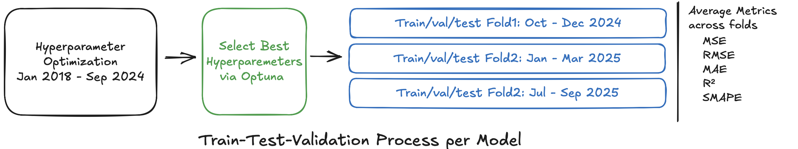

# Automotive Industry Trends Forecasting using Neural Networks

## Introduction 

The automotive industry is undergoing a transformative shift driven by the global transition toward electric mobility and sustainability initiatives. Understanding vehicle registration trends across different powertrain technologies—Electric (BEV), Hybrid, Diesel, and Petrol—is crucial for manufacturers, policymakers, and market analysts to make informed strategic decisions.

This project investigates time series forecasting of vehicle registration patterns in the German automotive market using state-of-the-art neural network architectures. Leveraging monthly registration data from the Kraftfahrt-Bundesamt (KBA) spanning 2018–2025, we analyze registration patterns across multiple Original Equipment Manufacturers (OEMs), vehicle models, and powertrain types at a granular level. The objective is to develop robust forecasting models capable of predicting future registration volumes, thereby providing actionable insights into the evolving landscape of automotive mobility.

The German market serves as an ideal case study given its position as Europe's largest automotive market and its ambitious electrification targets, making accurate forecasting essential for supply chain planning, production scheduling, and market strategy development.

## Problem Description

The challenge lies in forecasting monthly vehicle registration volumes for **1,502 individual time series**, where each series represents a unique combination of OEM, vehicle model, and powertrain type, with at least 12 historical data points and active values up to October 2025. The dataset encompasses:

- **Temporal Coverage:** January 2018 – October 2025 (monthly observations)
- **Total Data Points:** 107,922 observations
- **Average Series Length:** ~93 months per time series
- **Granularity:** Model-level registrations per powertrain type (e.g., BMW X1 Electric, Mercedes A-Class Diesel)

### Key Challenges

1. **High Dimensionality:** Managing 1,502 distinct time series with varying characteristics
2. **Multiple Powertrain Types:** Capturing diverging trends (e.g., rising EV adoption vs. declining diesel registrations)
3. **Market Dynamics:** Accounting for seasonal patterns, policy changes, and economic factors
4. **Data Sparsity:** Some model-powertrain combinations have limited historical data
5. **Structural Breaks:** COVID-19 pandemic effects, semiconductor shortages, and regulatory changes


### Forecasting Objective

Generate accurate multi-horizon forecasts across three distinct test periods to ensure robust model validation and avoid overfitting:

- **Test Period 1:** October – December 2024
- **Test Period 2:** January – March 2025
- **Test Period 3:** July – September 2025

Each model is trained exclusively on data preceding its respective test period, enabling evaluation across varying market conditions. Performance metrics are averaged across all three folds to establish true model performance.

**Possible Use Cases:**
- **Production Planning:** Optimizing manufacturing schedules and inventory management
- **Market Analysis:** Identifying growth opportunities and declining segments
- **Strategic Decision-Making:** Informing investment in powertrain technologies
- **Policy Evaluation:** Assessing the impact of incentive programs on EV adoption

## Solution Approach

### Data Architecture: Medallion Framework

The project follows the **Medallion Architecture** to ensure data quality and traceability across the machine learning pipeline:

#### 🥉 Bronze Layer (`data/raw/`)
- **Purpose:** Raw, unprocessed data as ingested from source systems

#### 🥈 Silver Layer (`data/processed/`)
- **Purpose:** Cleaned, validated, and standardized data

#### 🥇 Gold Layer (`data/gold/`)
- **Purpose:** Feature-engineered, analysis-ready datasets

### Forecasting Algorithms

The study benchmarks the follwing neural network architectures for time series forecasting:

- **MLP**: Multi-Layer Perceptron (fully connected feedforward network)
- **RNN**: Recurrent Neural Network (vanilla architecture with recurrent connections)
- **LSTM**: Long Short-Term Memory (RNN with gating mechanisms for long-term dependencies)
- **GRU**: Gated Recurrent Unit (simplified LSTM variant with fewer parameters)
- **Transformer**: Self-attention-based architecture for sequence modeling
- **CNN1D**: One-Dimensional Convolutional Neural Network (temporal pattern extraction)
- **N-BEATS**: Neural Basis Expansion Analysis for Time Series [Ref Paper](https://arxiv.org/pdf/1905.10437)
- **N-BEATSx**: N-BEATS with exogenous variable support [Ref Paper](https://arxiv.org/pdf/2104.05522)

### Exogenous Features 

To enhance forecasting accuracy, we incorporated carefully selected exogenous variables that capture macroeconomic conditions and market dynamics on a monthly basis:

- **Consumer Price Index**: Consumer price index is sourced from the Statistisches Bundesamt. [Link](https://www-genesis.destatis.de/datenbank/online/statistic/61111/table/61111-0002)
- **Deposit Facility Rate**: Deposit facility rate data is sourced from Deutsche Bundesbank. [Link](https://www.bundesbank.de/dynamic/action/en/statistics/time-series-databases/time-series-databases/759784/759784?listId=www_szista_mb01)
- **Employment Level:** Employment level data is available at Deutsche Bundesbank. [Link](https://www.bundesbank.de/dynamic/action/en/statistics/time-series-databases/time-series-databases/745582/745582?tsId=BBDL1.M.DE.N.EMP.EBA000.A0000.A00.D00.0.ABA.A&listId=www_siws_mb09_06b&dateSelect=2025
)
- **Gross Domestic Product:** GDP Data is available at Deutsche Bundesbank Website. [Link](https://www.bundesbank.de/dynamic/action/en/statistics/time-series-databases/time-series-databases/745582/745582?listId=www_ssb_lr_bip&tsId=BBNZ1.Q.DE.N.H.0000.L&dateSelect=2025)
- **Marginal Lending Rate**: Marginal Lending Rate is available at Deutsche Bundesbank Website. [Link](https://www.bundesbank.de/dynamic/action/en/statistics/time-series-databases/time-series-databases/759784/759784?listId=www_szista_mb01)
- **Historical Oil Prices**: The historical oil prices are available at the European Commission Website. [Link](https://energy.ec.europa.eu/data-and-analysis/weekly-oil-bulletin_en)

### Evaluation Framework

**Primary Metric:** **SMAPE (Symmetric Mean Absolute Percentage Error)**
- **Forecast Horizon:** 3 time periods each of a three month forecast
- **Evaluation Strategy:** Walk-forward validation with embargo periods to prevent lookahead bias
- **Success Criteria:** Minimizing SMAPE across all 1,502 time series

**Model Comparison Criteria:**
- Forecasting accuracy (SMAPE, MAE, RMSE, R2)

### Modelling Approach 

The following image summirizes the modelling approach:



Our framework combines Optuna-based hyperparameter optimization with three-fold cross-temporal validation. After tuning on Fold 1 (architecture parameters, learning rates, batch sizes), the optimal configuration is evaluated across all folds using early stopping and autoregressive forecasting. Experiments are tracked via Weights & Biases, with comprehensive metrics (MSE, RMSE, MAE, R², SMAPE) aggregated across all validation periods.

### Implementation Workflow

1. **Data Acquisition:** Automated download and versioning of source data
2. **Data Preprocessing:** Medallion architecture pipeline (Bronze → Silver → Gold)
3. **Exploratory Analysis:** Statistical profiling and visualization of registration trends
4. **Feature Engineering:** Creation of temporal and economic features
5. **Model Development:** Training and hyperparameter tuning for each algorithm
6. **Model Evaluation:** Comparative analysis using SMAPE on holdout period
---

## Project Structure

This report contains the following sections:

```{tableofcontents}
```
